# Expense Tracker

## About the Application

Expense Tracker is a full-stack web application designed to help users efficiently manage and track their daily expenses. The application provides a secure and user-friendly platform for recording expenses, organizing them into categories, and monitoring spending patterns.

The system includes a complete authentication workflow with user registration, email verification, traditional email/password login, Google Authentication (OAuth 2.0), forgot password, and password reset functionality. Once authenticated, users can manage expenses, organize categories, and maintain their profile information through an intuitive dashboard.

The application is built using modern web technologies with a React.js frontend, NestJS backend, PostgreSQL database, and Docker-based containerization, ensuring scalability, maintainability, and a seamless user experience.

## Key Features

- User Registration and Login
- Google Authentication (OAuth 2.0)
- Email Verification
- Forgot Password and Reset Password
- Dashboard with Expense Overview
- Expense Management (Create, View, Update, Delete)
- Category Management
- User Profile Management
- Secure JWT Authentication
- PostgreSQL Database Integration
- Dockerized Deployment

## Tech Stack

### Frontend

- React.js
- Material UI (MUI)
- React Router
- Axios

### Backend

- NestJS
- TypeScript
- JWT Authentication

### Database

- PostgreSQL
- TypeORM

### DevOps

- Docker
- Docker Compose

......................................................................................................

# Application Screenshots

## 1. Login Page

The Login page allows registered users to securely access the Expense Tracker application using their email and password.

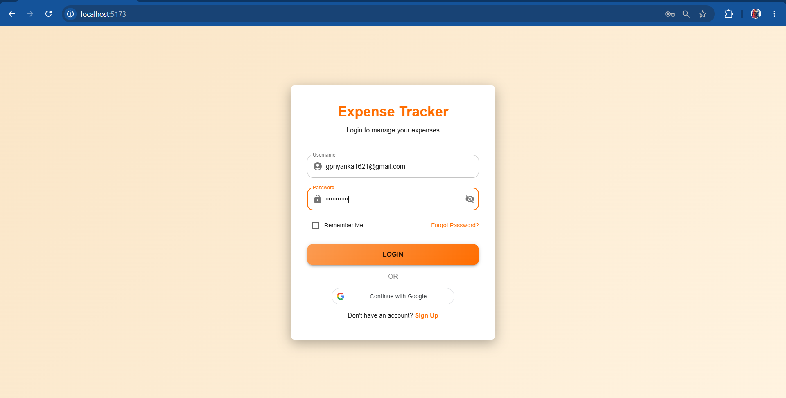

---

## 2. Sign Up Page

The Sign Up page enables new users to create an account by providing their basic details and credentials.

---

## 3. Forgot Password

Users can request a password reset link by entering their registered email address.

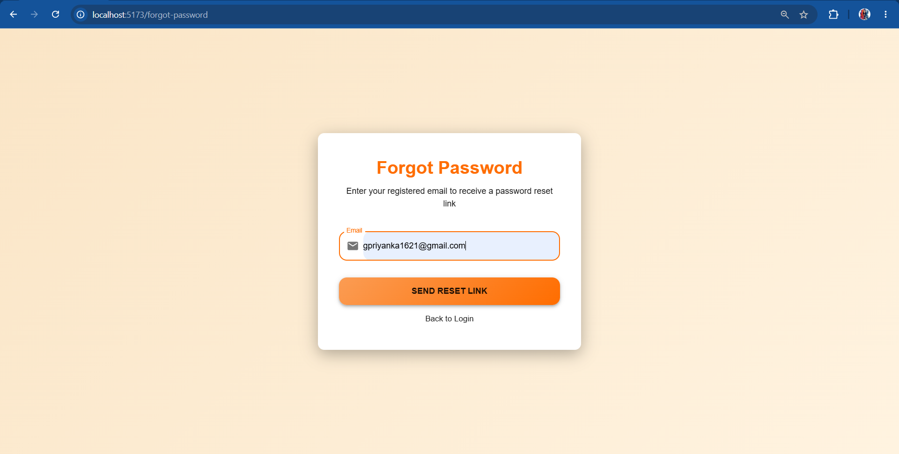

---

## 4. Password Reset Request Confirmation

Upon requesting a password reset, the application displays a confirmation message informing the user that a password reset link has been sent to their registered email address. Users can follow the link provided in the email to securely create a new password.

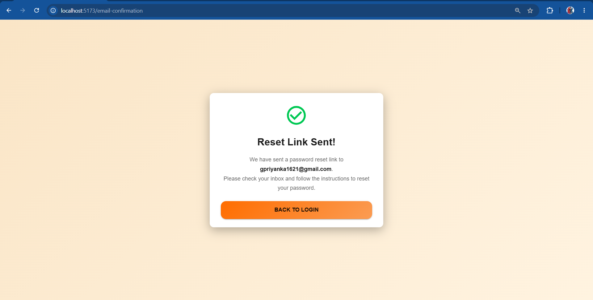

---

## 5. Password Reset Email

After submitting the password reset request, the user receives a password reset email containing a secure, time-limited link. By clicking the link, the user is redirected to the rest password page, where they can create a new password and securely regain access to their account.

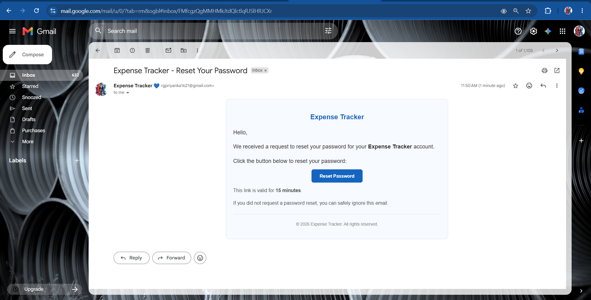

---

## 6. Reset Password

Users can securely reset their password using the reset link received via email.

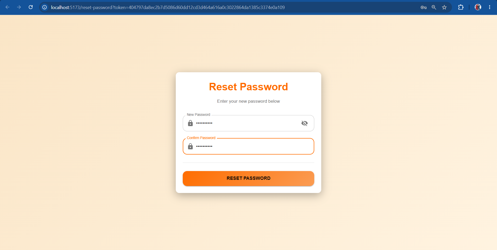

---

## 7.Google Authentication

Users can securely sign in using their Google account, eliminating the need to create and manage a separate password. The application leverages Google OAuth 2.0 for a seamless and secure authentication experience.

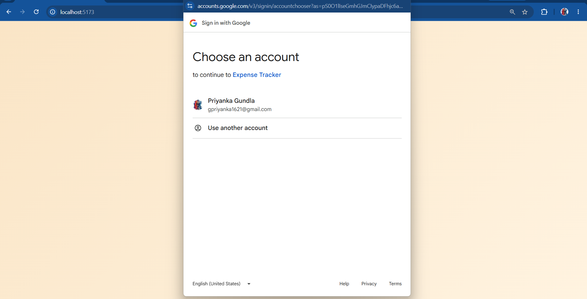

---

## 8. Dashboard

The Dashboard serves as the central hub of the Expense Tracker application, providing users with a comprehensive overview of their financial activity. It displays key metrics such as Total Income, Total Expenses, and Total Savings, enabling users to monitor their financial health at a glance.

The dashboard also includes expense analytics, category-wise spending insights, and summary statistics that help users understand spending patterns, track savings against income, and make informed financial decisions.

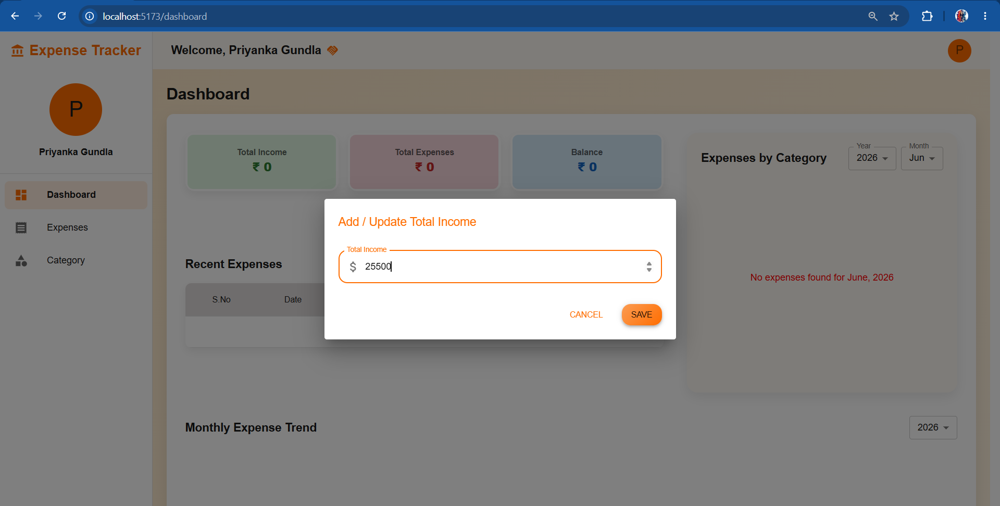
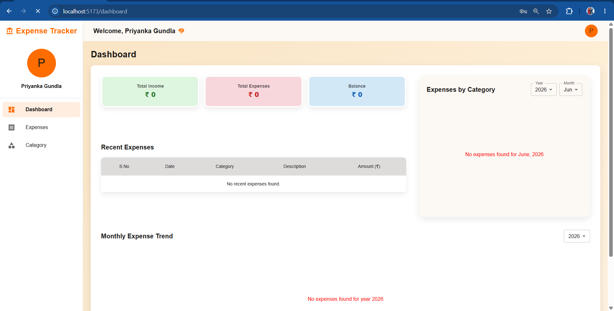
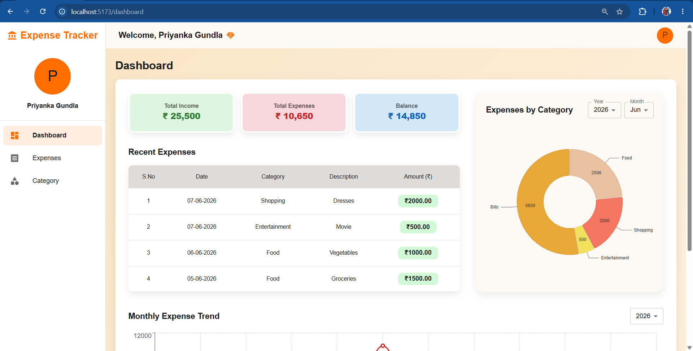
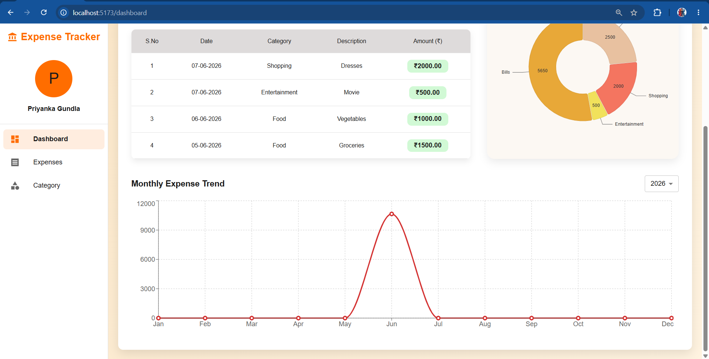

---

## 9. Expenses Management

The Expenses module enables users to efficiently manage their financial records by providing functionality to add, view, update, and delete expense entries. Users can track their spending history, monitor expenses across different categories, and maintain accurate financial records.

To enhance usability, the module includes advanced search and filtering capabilities, allowing users to quickly find expenses based on year, month, or specific keywords. This helps users analyze spending patterns and access relevant expense data with ease.

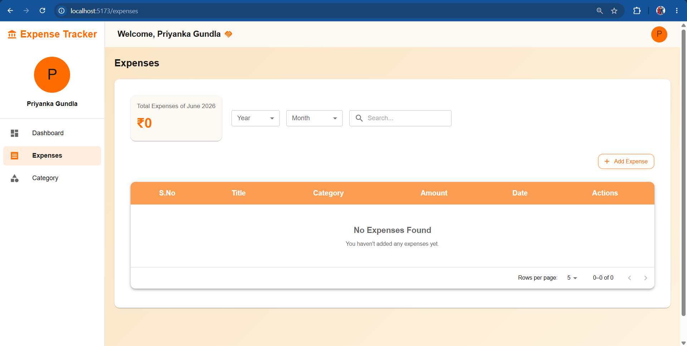
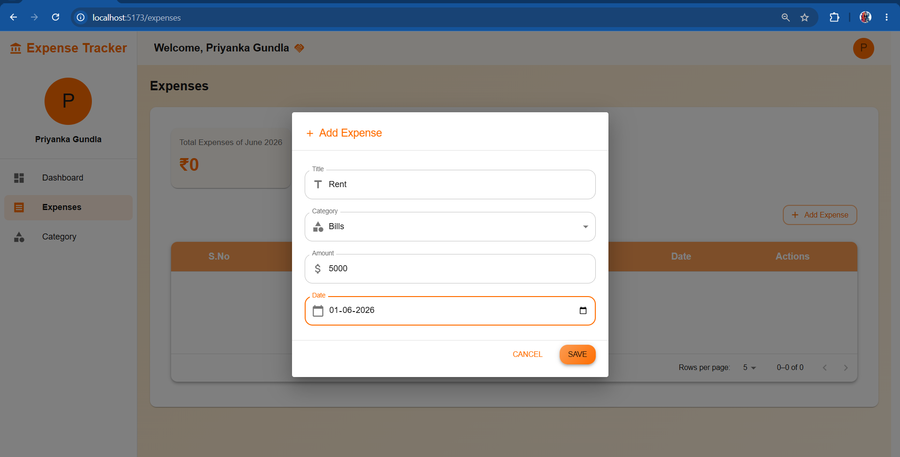
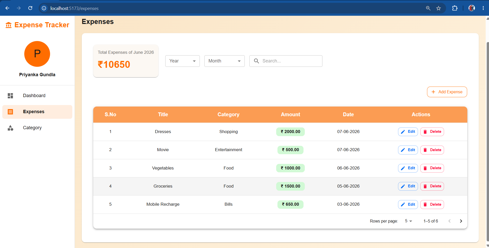

---

## 10. Category Management

The Category Management module allows users to create, view, update, and delete expense categories, providing a structured way to organize financial transactions. Categories help users classify expenses such as Food, Transportation, Shopping, Entertainment, Utilities, and other custom expense types.

By organizing expenses into categories, users can gain better visibility into their spending habits, analyze category-wise expenditures, and generate more meaningful financial insights through the dashboard and expense reports.

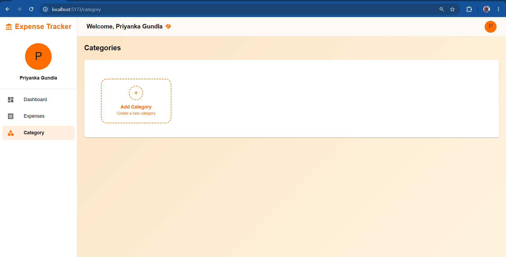
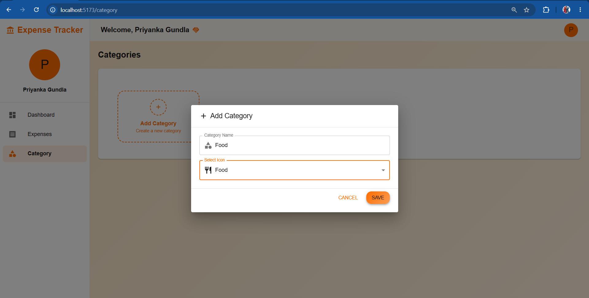
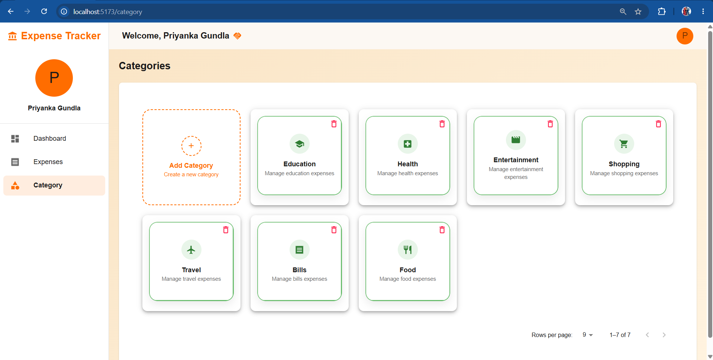

---

## 11. View Profile

The View Profile page displays user account information and profile details.

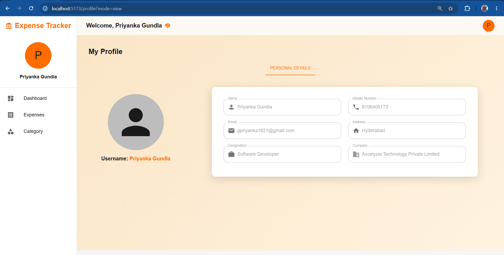

---

## 12. Edit Profile

Users can update their profile information and maintain accurate account details. In addition to update profile, the page includes a Change Password feature, enabling users to securely update their account credentials and enhance account security.

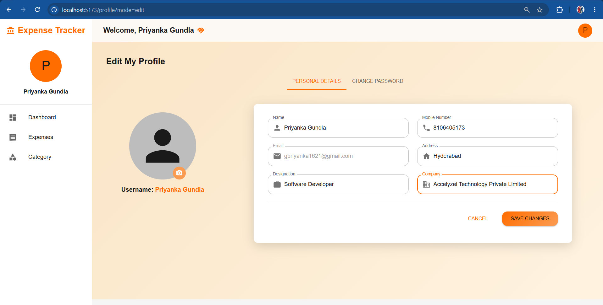
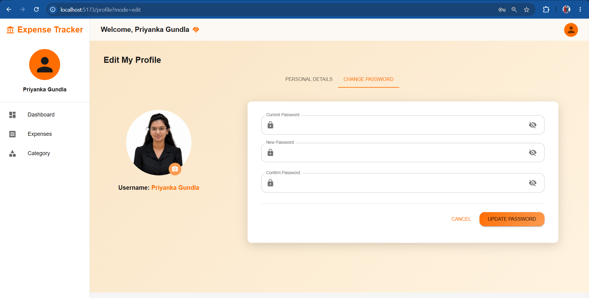
